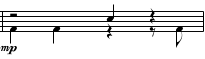

# Mary Did You Know

- SATBB Version:
https://www.youtube.com/watch?v=tcN7e5RpcLw
- Pentatonix Version: https://www.youtube.com/watch?v=ifCWN5pJGIE

## Beatbox Motifs von Bariton

### Beatbox-Motif #1 ab T28
Sopran übernimmt Melodie von Bass

Hier brauchen wir eine Kick und eine Snare so wie hier:
[Motif #1](motif1.ogg)

Um noch etwas mehr Bass und Klang reinzubringen, können wir noch unseren Kehlkopf dazunehmen:
[Motif #1 mit Extra Bass](motif1_mit_mehr_bass.ogg)

Das machen wir bis zum Break in T44.
Ab T42 Crescendo.

Cymbal roll machen wir mit einem Schlangen-S.
[Motif #1 Ende](motif1_ende.ogg)

### Motif 2

Zuerst singen, dann übernimmt Tenor.

**Vorsicht**: Auf die Viertel!

Und hier hab ich mich deppad gspielt: [Motif #2 ganz](motif2.ogg)

## Kick Drum

### Basics
Kick Drum ist mehr oder weniger ein B, nur sehr BUM halt.

Videos:
- [Kick von Beatbox Germany](https://www.youtube.com/watch?v=slGs_d59bx8)
- [BASIC BEATBOX TUTORIAL - KICK DRUM](https://www.youtube.com/watch?v=m37cDsDl-4I)
- [How To Beatbox The Kick Drum In Under 1 Minute](https://www.youtube.com/shorts/IIS4BDxbDPI) &lt;- YT Short

## (Inward-)K-Snare

Ksch-Sound

- [K-Snare von Beatbox Germany](https://www.youtube.com/watch?v=Q_8JlHnFveE) <-- Mit dem Anfangen
- [Inward-K Snare von Beatbox Germany](https://www.youtube.com/watch?v=QHAc13bcNYg) <-- Oder gleich mit dem? **Das ist die die wir brauchen**

## We need MORE Bass on the Kick!
Videos zur Throat Kick:
- [Throat Kick Beatbox Tutorial - Fredy Beats](https://www.youtube.com/shorts/HurF46T7A88) &lt;- YT Short
- [Throat Kick Tutorial von oZealous](https://www.youtube.com/watch?v=URJOqKSLXPU)

Beides kombinieren für vollen und geschmeidigen Klang.

1. Throat Kick und normalen Kick Drum gleichzeitig machen.
2. ?????????????????????
3. Profit!

## Pf-Snare (nicht in Mary Did You Know, aber GEIL!)

- [Pf-Snare von Beatbox Germany](https://www.youtube.com/watch?v=wzauFNdd-I8)